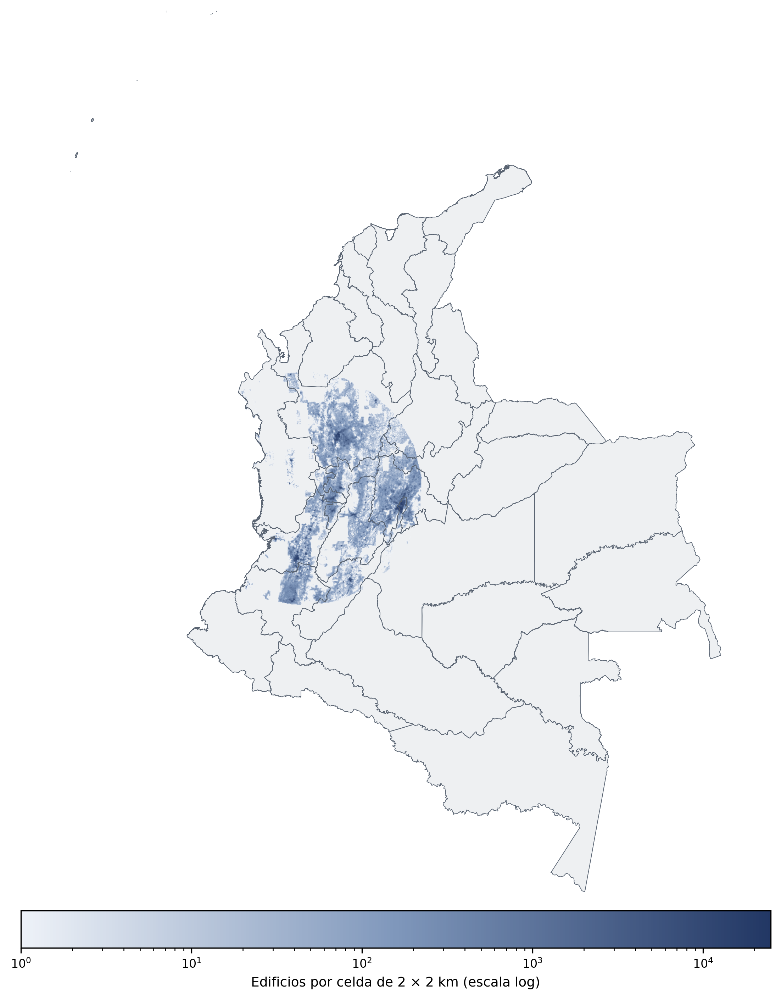

# Mapa de escenario de daño {.unnumbered}

<!-- TODO: el conjunto de datos disponible cubre el corredor andino suroccidental
     (Valle del Cauca, Cauca y zonas aledañas), no la totalidad del territorio nacional.
     Ajustar el alcance/título si se espera cobertura nacional completa, o aclarar aquí
     que corresponde a un área de estudio específica. -->

El siguiente mapa muestra la densidad de edificaciones agregada en celdas de 2 × 2 km, como indicador de exposición física en el área cubierta por el conjunto de datos. Dada la alta concentración de construcciones en zonas urbanas frente a zonas rurales, la escala de color es logarítmica.

{#fig-densidad-edificaciones}
