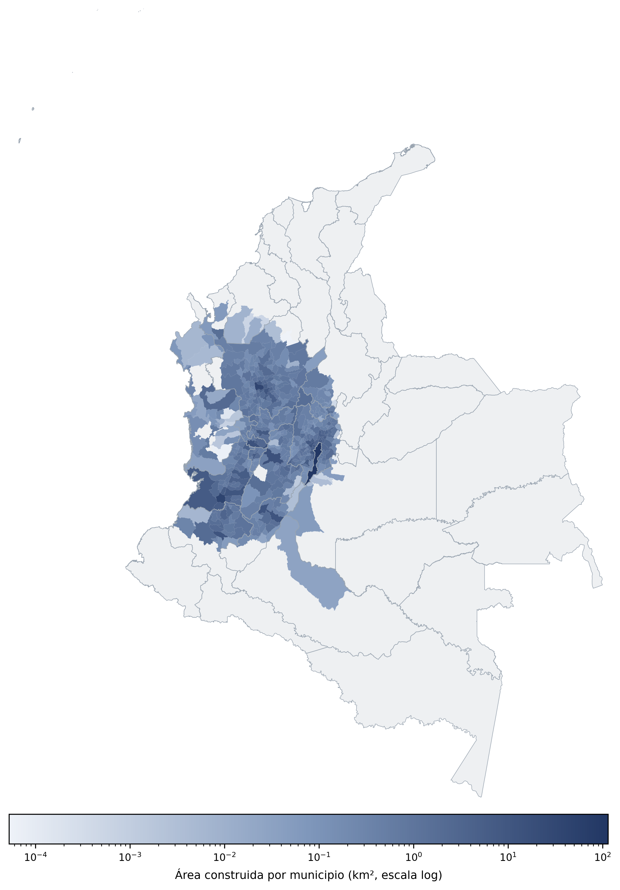

# Mapa de escenario de daño {.unnumbered}

<!-- TODO: el conjunto de datos disponible cubre el corredor andino suroccidental
     (Valle del Cauca, Cauca y zonas aledañas), no la totalidad del territorio nacional.
     Ajustar el alcance/título si se espera cobertura nacional completa, o aclarar aquí
     que corresponde a un área de estudio específica. -->

El siguiente mapa muestra la densidad de edificaciones agregada en celdas de 2 × 2 km, como indicador de exposición física en el área cubierta por el conjunto de datos. Dada la alta concentración de construcciones en zonas urbanas frente a zonas rurales, la escala de color es logarítmica.

{#fig-densidad-edificaciones}

## Área construida por municipio

Para complementar la vista por celdas, se calculó el área construida total agregando el atributo `area_m2` de cada edificación al municipio que la contiene (unión espacial del centroide de cada polígono contra los límites municipales de Colombia, IGAC/DANE). En el área cubierta por el conjunto de datos, el total de área construida es de **761 km²**, distribuidos en 473 municipios con al menos una edificación detectada.

Los 20 municipios con mayor área construida:

| Municipio | Departamento | Edificios | Área construida (km²) |
|---|---|---:|---:|
| Bogotá D.C. | Bogotá D.C. | 904,770 | 114.45 |
| Santiago de Cali | Valle del Cauca | 374,320 | 43.20 |
| Medellín | Antioquia | 366,425 | 37.27 |
| Ibagué | Tolima | 118,894 | 15.22 |
| Madrid | Cundinamarca | 27,466 | 14.45 |
| Pereira | Risaralda | 109,731 | 14.11 |
| Neiva | Huila | 100,321 | 12.21 |
| Popayán | Cauca | 113,846 | 12.19 |
| Rionegro | Antioquia | 56,887 | 11.28 |
| Palmira | Valle del Cauca | 69,772 | 10.95 |
| Soacha | Cundinamarca | 82,325 | 10.74 |
| Facatativá | Cundinamarca | 24,007 | 8.70 |
| Funza | Cundinamarca | 20,086 | 8.35 |
| Manizales | Caldas | 62,210 | 8.28 |
| Chía | Cundinamarca | 46,747 | 7.61 |
| Bello | Antioquia | 76,214 | 7.45 |
| Buenaventura | Valle del Cauca | 88,811 | 7.15 |
| Armenia | Quindío | 59,540 | 7.08 |
| Yumbo | Valle del Cauca | 40,881 | 6.76 |
| El Rosal | Cundinamarca | 9,799 | 6.64 |

: Área construida por municipio (top 20) {#tbl-area-municipios}

El listado completo (473 municipios) está disponible para descarga: [`area_por_municipio.csv`](data/area_por_municipio.csv).

{#fig-area-municipios}

# Mapa Interactivo de Exposición de Edificaciones

Huellas de construcción · PMTiles + MapLibre GL · Fuente: Google Open Buildings (GEE)

```{=html}
<!-- ── Dependencias MapLibre GL + PMTiles (locales) ────────────────────── -->
<link  href="libs/maplibre-gl.css" rel="stylesheet">
<script src="libs/maplibre-gl.js"></script>
<script src="libs/pmtiles.js"></script>

<style>
  #map-edificios {
    width: 100%;
    height: 78vh;
    border-radius: 10px;
    border: 1px solid #c8d6df;
  }

  #map-info {
    background: rgba(34, 55, 100, 0.88);
    color: white;
    padding: 6px 14px;
    border-radius: 0 0 10px 10px;
    font-size: 12px;
    font-family: system-ui, sans-serif;
    min-height: 28px;
  }

  .layer-toggle {
    position: absolute;
    top: 10px;
    right: 10px;
    background: white;
    border-radius: 8px;
    padding: 10px 14px;
    font-family: system-ui, sans-serif;
    font-size: 13px;
    box-shadow: 0 2px 8px rgba(0,0,0,0.2);
    z-index: 10;
    line-height: 1.8;
  }
  .layer-toggle b { color: #223764; }
</style>

<div style="position:relative;">
  <div id="map-edificios"></div>

  <div class="layer-toggle">
    <b style="display:block;margin-bottom:4px;">Color por</b>
    <label><input type="radio" name="colorMode" value="area" checked> Área construida</label><br>
    <label><input type="radio" name="colorMode" value="confiab"> Confianza de detección</label>
  </div>
</div>

<div id="map-info">Edificaciones · Fuente: Google Open Buildings vía Google Earth Engine</div>

<script>
(function () {
  // ── 1. Registrar protocolo PMTiles ANTES de crear el mapa ──────────────
  const protocol = new pmtiles.Protocol();
  maplibregl.addProtocol("pmtiles", protocol.tile.bind(protocol));

  const pmtilesUrl = "pmtiles://" + new URL("data/edificios.pmtiles", window.location.href).href;

  // ── 2. Inicializar mapa con basemap CartoDB Positron ─────────────────────
  const map = new maplibregl.Map({
    container: "map-edificios",
    style: {
      version: 8,
      sources: {
        "carto-light": {
          type: "raster",
          tiles: [
            "https://a.basemaps.cartocdn.com/light_all/{z}/{x}/{y}.png",
            "https://b.basemaps.cartocdn.com/light_all/{z}/{x}/{y}.png"
          ],
          tileSize: 256,
          attribution: "© <a href='https://carto.com/'>CartoDB</a> © <a href='https://openstreetmap.org'>OSM</a>"
        }
      },
      layers: [
        { id: "basemap", type: "raster", source: "carto-light" }
      ]
    },
    center: [-75.9, 4.4],
    zoom: 7,
    minZoom: 4,
    maxZoom: 18
  });

  map.addControl(new maplibregl.NavigationControl(), "top-left");
  map.addControl(new maplibregl.ScaleControl({ unit: "metric" }), "bottom-left");

  map.on("error", (e) => console.error("[MapLibre]", e.error));

  const FILL_AREA = [
    "interpolate", ["linear"], ["get", "area_m2"],
    20, "#a8bad6",
    60, "#7f97bb",
    150, "#5674a8",
    500, "#223764"
  ];
  const FILL_CONFIAB = [
    "interpolate", ["linear"], ["get", "confiab"],
    0.6, "#a8bad6",
    0.75, "#7f97bb",
    0.85, "#5674a8",
    1.0, "#223764"
  ];

  map.on("load", () => {
    map.addSource("edificios", {
      type: "vector",
      url: pmtilesUrl
    });

    map.addLayer({
      id: "edificios-fill",
      type: "fill",
      source: "edificios",
      "source-layer": "edificios",
      paint: {
        "fill-color": FILL_AREA,
        "fill-opacity": 0.55
      }
    });

    map.addLayer({
      id: "edificios-line",
      type: "line",
      source: "edificios",
      "source-layer": "edificios",
      minzoom: 13,
      paint: {
        "line-color": "#223764",
        "line-width": ["interpolate", ["linear"], ["zoom"], 13, 0.3, 17, 1],
        "line-opacity": ["interpolate", ["linear"], ["zoom"], 13, 0.2, 16, 0.75]
      }
    });

    document.querySelectorAll('input[name="colorMode"]').forEach((radio) => {
      radio.addEventListener("change", (e) => {
        const expr = e.target.value === "area" ? FILL_AREA : FILL_CONFIAB;
        map.setPaintProperty("edificios-fill", "fill-color", expr);
      });
    });
  });

  // ── 3. Popup al hacer clic ──────────────────────────────────────────────
  const popup = new maplibregl.Popup({ closeButton: false, maxWidth: "220px" });

  map.on("click", "edificios-fill", (e) => {
    if (!e.features.length) return;
    const p = e.features[0].properties;
    popup
      .setLngLat(e.lngLat)
      .setHTML(
        `<b style="font-size:13px">Edificación</b>
         <br><span style="font-size:11px;color:#555">Área: ${Number(p.area_m2).toFixed(1)} m²</span>
         <br><span style="font-size:11px;color:#555">Confianza: ${Number(p.confiab).toFixed(2)}</span>`
      )
      .addTo(map);
  });

  map.on("mouseenter", "edificios-fill", () => { map.getCanvas().style.cursor = "pointer"; });
  map.on("mouseleave", "edificios-fill", () => { map.getCanvas().style.cursor = ""; });

})();
</script>
```

> **Nota metodológica:** Las huellas de edificaciones provienen del conjunto de datos [Open Buildings](https://sites.research.google/open-buildings/) de Google, obtenidas vía Google Earth Engine y convertidas al formato [PMTiles](https://docs.protomaps.com) con [tippecanoe](https://github.com/felt/tippecanoe) para distribución eficiente vía HTTP Range Requests. Los tiles se generan hasta zoom 13 (el navegador amplía automáticamente más allá de ese nivel); esto mantiene el archivo en 37.7 MB, dentro del límite de tamaño de GitHub, sin pérdida perceptible de nitidez en los polígonos individuales. La cobertura actual corresponde al corredor andino suroccidental de Colombia (no a la totalidad del territorio nacional).

<!-- Nota: data/edificios.pmtiles (37.7 MB, maxzoom=13) sí está en git — cabe bajo el límite de
     100 MB de GitHub sin necesitar hosting externo. Localmente solo funciona con `npx serve`
     (no con `quarto preview`, que no soporta Range Requests). Ver data/generar_pmtiles.sh
     para regenerarlo. -->
